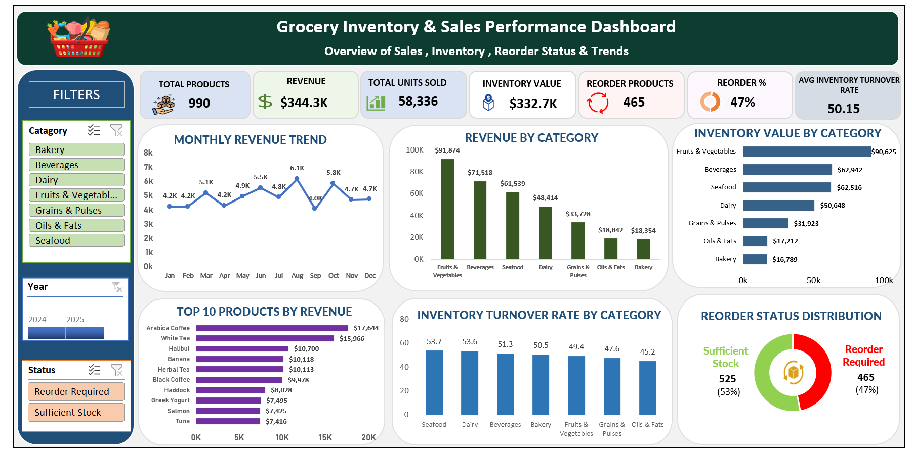

# 🛒 Grocery Inventory & Sales Performance Dashboard | Microsoft Excel

An end-to-end **Data Analytics Project** built using **Microsoft Excel** to analyze grocery sales performance, inventory levels, product performance, and stock replenishment requirements. This project demonstrates the complete analytics workflow—from raw data cleaning and transformation to KPI development, Pivot Table analysis, interactive dashboard development, and actionable business insights.

---

# 📌 Project Overview

The objective of this project is to analyze grocery inventory and sales data and provide business insights that help stakeholders understand revenue performance, inventory investment, product performance, and replenishment requirements.

The project covers the complete analytics lifecycle:

- Data Collection
- Data Cleaning
- Data Transformation
- Calculated Column Creation
- Pivot Table Analysis
- Pivot Chart Development
- KPI Development
- Interactive Dashboard Development
- Business Insights & Recommendations

---

# 🛠️ Tools & Technologies

| Tool | Purpose |
| ---------------- | ------------------------------ |
| Microsoft Excel | Data Analysis & Dashboard Development |
| Excel Formulas | Data Cleaning & Calculations |
| Pivot Tables | Data Aggregation & Analysis |
| Pivot Charts | Data Visualization |
| Slicers | Interactive Filtering |
| Timeline | Year-based Filtering |
| Conditional Formatting | Visual Analysis |
| GitHub | Project Documentation |

---

# 📂 Repository Structure

```text
Excel_grocery-inventory-sales-performance-dashboard
│
├── README.md
│
├── 01_Dataset
│   └── Grocery_Inventory_and_Sales_Dataset.csv
│
├── 02_Project_File
│   └── Grocery_Inventory&Sales_Dashboard.xlsx
│
├── 03_Dashboard
│   └── Dashboard.png
│
├── 04_Documentation
│   ├── 01_Business_Requirement_Document.pdf
│   ├── 02_Domain_Knowledge_Document.pdf
│   ├── 03_Data_Cleaning_Process.pdf
│   ├── 04_Project_Report.pdf
│
└── LICENSE
````

---

# 📊 Dashboard Features

### Executive Dashboard

* Total Products
* Total Revenue
* Total Units Sold
* Inventory Value
* Reorder Products
* Reorder Percentage
* Average Inventory Turnover Rate
* Monthly Revenue Trend
* Revenue by Category
* Inventory Value by Category
* Top 10 Products by Revenue
* Inventory Turnover Rate by Category
* Reorder Status Distribution

---

# 🎛️ Interactive Filters

The dashboard includes interactive filters for:

* Category
* Year
* Reorder Status

These filters allow users to dynamically analyze sales and inventory performance.

---

# 🧹 Data Cleaning & Transformation

The following data preparation activities were performed before developing the dashboard:

* Standardized mixed date formats
* Converted Unit Price from text to numeric values
* Validated data types
* Created Revenue column
* Created Inventory Value column
* Created Reorder Status column
* Created Month/Year helper fields
* Validated cleaned data before analysis

---

# 🧮 Calculated Columns

### Revenue

```text
Revenue = Sales Volume × Unit Price
```

### Inventory Value

```text
Inventory Value = Stock Quantity × Unit Price
```

### Reorder Status

```text
IF(Stock Quantity < Reorder Level,
   "Reorder Required",
   "Sufficient Stock")
```

These calculated fields were used for KPI calculations, Pivot Tables, charts, and dashboard analysis.

---

# 📈 Key Performance Indicators

The dashboard contains the following KPIs:

| KPI                             | Value   |
| ------------------------------- | ------- |
| Total Products                  | 990     |
| Total Revenue                   | $344.3K |
| Total Units Sold                | 58,336  |
| Inventory Value                 | $332.7K |
| Reorder Products                | 465     |
| Reorder Percentage              | 47%     |
| Average Inventory Turnover Rate | 50.15   |

---

# 📌 Key Business Insights

### 💰 Sales Performance

* Total revenue generated is approximately **$344.3K**.
* **Fruits & Vegetables** generate the highest revenue among the product categories.
* **Arabica Coffee** is the top revenue-generating product.
* Monthly revenue trends help identify changes in sales performance throughout the year.

---

### 📦 Inventory Performance

* Total inventory value is approximately **$332.7K**.
* **Fruits & Vegetables** have the highest inventory value among the categories.
* **Seafood** records the highest inventory turnover rate.
* The average inventory turnover rate is **50.15**.

---

### 🔄 Reorder Analysis

* **465 products**, representing **47%** of the product portfolio, require replenishment.
* **525 products**, representing **53%**, have sufficient stock.
* The reorder analysis helps identify products that may require inventory attention.

---

### 🏆 Product Performance

* **Arabica Coffee** is the highest revenue-generating product.
* The Top 10 Products by Revenue visualization highlights the products contributing most to overall sales.
* Category-level analysis helps identify high-performing and lower-performing product segments.

---

# 📈 Business Recommendations

* Prioritize replenishment for products identified as **Reorder Required**.
* Monitor inventory levels for high-value categories.
* Maintain sufficient stock for high-revenue products.
* Monitor inventory turnover to improve inventory efficiency.
* Focus sales and promotional activities on high-performing product categories.
* Regularly review inventory value and reorder requirements to reduce stock-related risks.

---

# 📷 Dashboard Preview

## Grocery Inventory & Sales Performance Dashboard



---

# 📄 Documentation

This repository also contains:

* Business Requirement Document
* Domain Knowledge Document
* Data Cleaning Process
* Project Report

These documents explain the project requirements, business domain, data preparation process, analysis methodology, dashboard development, business insights, and interview preparation.

---

# 🎯 Skills Demonstrated

* Microsoft Excel
* Data Cleaning
* Data Transformation
* Excel Formulas
* Pivot Tables
* Pivot Charts
* KPI Development
* Dashboard Design
* Interactive Reporting
* Inventory Analysis
* Sales Analysis
* Revenue Analysis
* Data Visualization
* Business Analysis
* Business Storytelling
* GitHub Documentation

---

# 👨‍💻 Author

**Nikhil Ramagiri**

Aspiring Data Analyst | Excel | SQL | Power BI | Python

📧 Email: [ramagirin45@gmail.com](mailto:ramagirin45@gmail.com)

🔗 LinkedIn: [https://www.linkedin.com/in/nikhil-ramagiri-21b2a324a](https://www.linkedin.com/in/nikhil-ramagiri-21b2a324a)

🔗 GitHub: [https://github.com/RamagiriNikhil](https://github.com/RamagiriNikhil)

---

## ⭐ If you found this project useful, consider giving this repository a Star!

````
